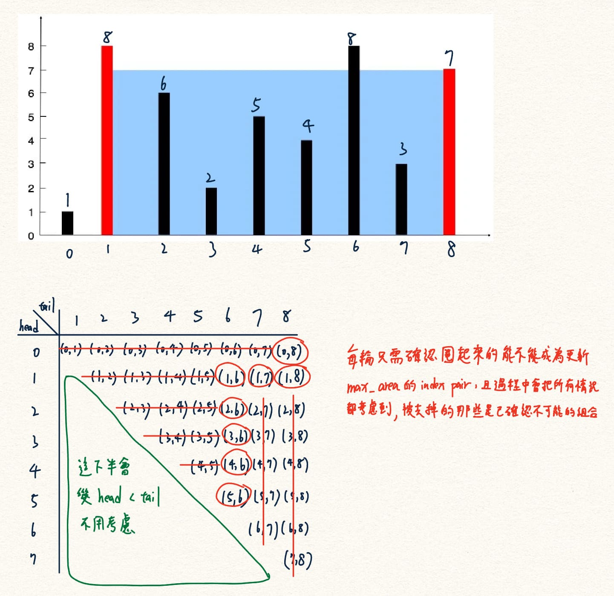

# Solution 1 ⭐

[← 回到 L11: Container With Most Water](README.md)



`Time: O(n)`

`Space: O(1)`

<details>
<summary>展開程式碼</summary>

```cpp
class Solution {
public:
    int maxArea(vector<int>& height) {
        int max_area = 0;
        int min_height = INT_MAX;
        int head = 0;
        int tail = height.size()-1;;
        while(head < tail){
            min_height = min(height[head], height[tail]);
            max_area = max(max_area, min_height*(tail-head));
            if(min_height == height[head]) head++;
            else tail--; 
        }
        return max_area;
    }
};
```

</details>
