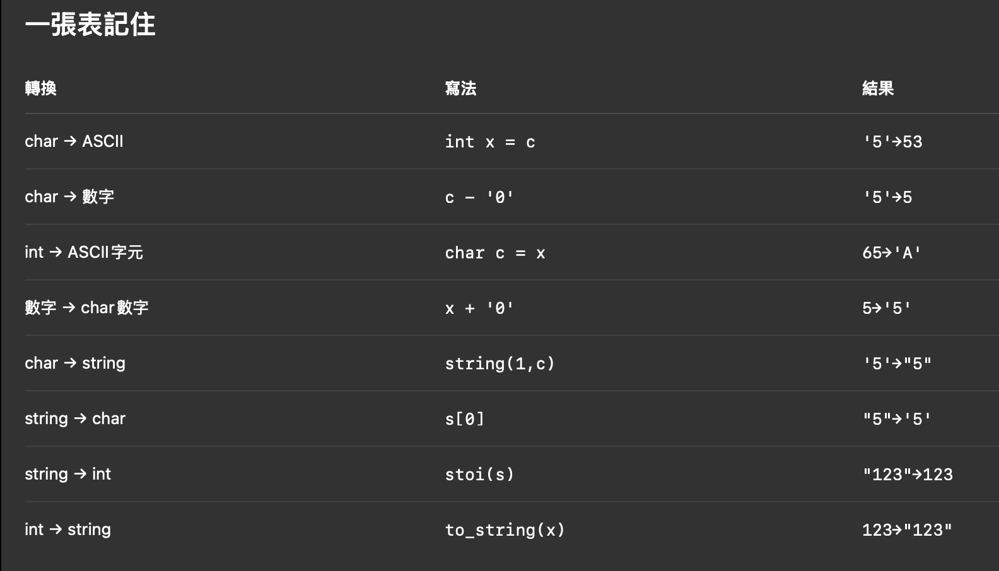

# Solution 1 ⭐

[← 回到 L36: Valid Sudoku](README.md)

很妙的想法，遍歷到每個元素時，自己表態屬於哪行、哪列、哪block，資訊都加入同個set，
不然原本的方法是跑三次雙層回圈分別判斷每行、每列、每block是否有重複。

這裡很麻煩的是型別轉換，還有注意串接的第一個要是string才有辦法和後面的string、chary做串接。
另外注意set的insert會回傳pair<iterator, bool>


`Time:O(81)
Space:O(81)`

<details>
<summary>展開程式碼</summary>

```cpp
class Solution {
public:
    bool isValidSudoku(vector<vector<char>>& board) {
        unordered_set<string> s;
        const int n = 9; 
        for(int i = 0; i < n ; i++){
            for(int j = 0; j < n; j++){
                string number = string(1,board[i][j]);
                if(number != string(1,'.')){
                    if(!s.insert(number + "in row" + to_string(i)).second||
                       !s.insert(number + "in column" + to_string(j)).second||
                       !s.insert(number + "in block" + to_string(i/3) + to_string(j/3)).second) return false; //這邊將屬於同block的都壓縮成同一座標。  
                }
            }    
        }
        return true;    
    }
};
```

</details>
