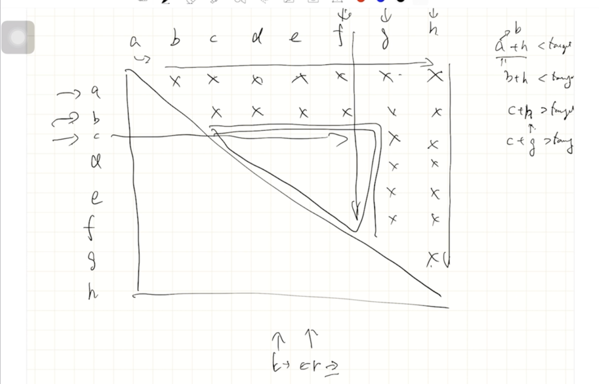

# Solution 3 ⭐

[← 回到 L167: Two Sum II - Input Array Is Sorted](README.md)

two pointers法，之後練習用這個方法。
每次判斷移動頭或尾巴，一次能去除一排可能，範圍收斂，不會錯過解答。


`Time: O(nlogn)`

`Space: O(1)`

<details>
<summary>展開程式碼</summary>

```cpp
class Solution {
public:
    vector<int> twoSum(vector<int>& numbers, int target) {
        int left = 0;
        int right = numbers.size()-1;
        while(left != right){
            int tmp = numbers[left] + numbers[right];
            if(tmp == target){
                return vector<int> {left+1, right+1};    
            }
            else if(tmp < target) left++;
            else right--;
        }
        return  vector<int> {};
    }
};
```

</details>
